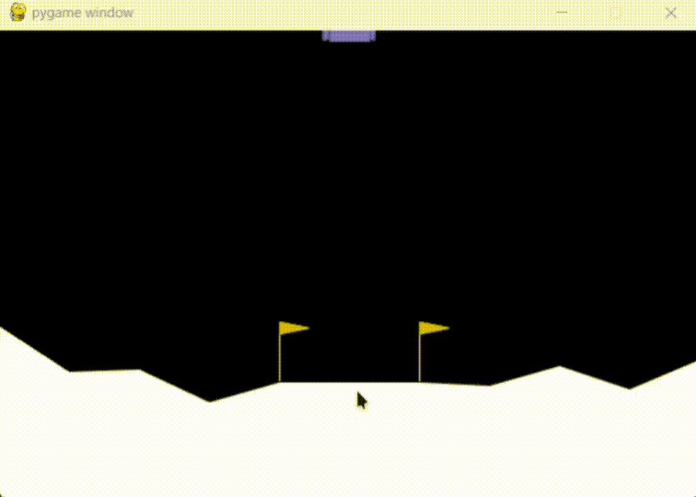

# 🌕🚀Lunar Lander with NEAT

Introducing you to a project that implements a solution to the classic Lunar Lander problem using the NEAT (NeuroEvolution of Augmenting Topologies) algorithm using the [Gymnasium](https://github.com/Farama-Foundation/Gymnasium) Environment

-----------------------

<p align="center">
  
</p>

<p align="center"><em>Demonstration of a trained neural network successfully landing the spacecraft</em></p>


------------------------

## 1. Overview

The Lunar Lander environment is a classic problem where the goal is to safely land a spacecraft on the moon's surface. In this project, we employ the NEAT algorithm to evolve neural networks that can control the lander to achieve a safe landing.

## 2. Technical Details

This project implements `Reinforcement Learning` through neuroevolution. The NEAT algorithm evolves neural networks that learn optimal control policies through interaction with the environment. The networks receive state observations as input and output control actions, improving their performance through evolutionary selection.


## 3. Repository Contents

- `lunar_lander_neat.py`: The main script that sets up the environment and runs the NEAT algorithm.
- `config-feedforward.txt`: Configuration file for the NEAT algorithm.
- `visualize_network.py`: Utility script to visualize the neural network architectures evolved by NEAT.
- `result.txt`: Contains results from my NEAT runs.

## Getting Started

To run this project, follow these steps:

1. **Clone the repository:**

   ```bash
   git clone https://github.com/RiddhiRaj/lunar-lander.git
   cd lunar-lander
   ```
2. **Set up a Python virtual environment:**
    
    Create a virtual environment
    ```bash
    python -m venv venv
    ```
    
    Activate the virtual environment
    On Windows:
    ```bash
    .\venv\Scripts\activate
    ```

    On Unix or MacOS:
    ```bash
    source venv/bin/activate
    ```

2. **Install the required dependencies:**

   Ensure you have Python installed. Then, install the necessary packages:

   ```bash
   pip install -r requirements.txt
   ```

3. **Run the NEAT algorithm:**

   Execute the main script to start the training process:

   ```bash
   python lunar_lander_neat.py
   ```

   The script will evolve neural networks to control the lunar lander. Training progress and results will be displayed in the console.

4. **Visualize the results:**

   After training, you can visualize the evolved neural network using:

   ```bash
   python visualize_network.py
   ```

   This will generate a graphical representation of the best-performing neural network.

## Acknowledgments

This project utilizes the NEAT-Python library for implementing the NEAT algorithm. For more information on NEAT and its Python implementation, visit the [NEAT-Python documentation](https://neat-python.readthedocs.io/en/latest/index.html).

---

Feel free to explore the code and experiment with different configurations to improve the lander's performance or maybe optimize it with other methods. Happy coding!

## Tags 🏷️


